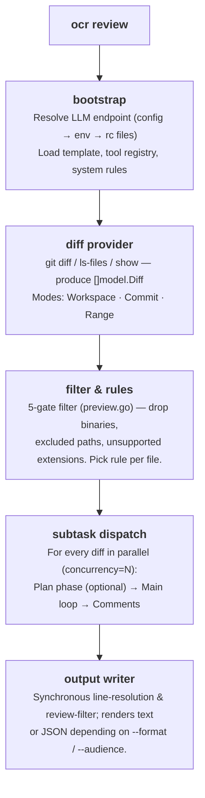
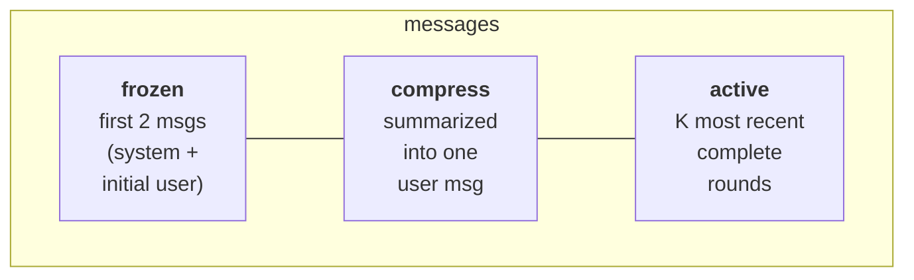

A walk-through of how `ocr review` actually works inside, from the moment
you press Enter to the JSON that lands in your terminal. The goal is to
give you enough mental model to debug behaviour, tune flags, and read
the source code with confidence.

## High-level pipeline



The orchestration lives in the
[`internal/agent/`](https://github.com/alibaba/open-code-review/blob/main/internal/agent/)
package, which spans four files: `agent.go` (main loop & dispatch),
`compression.go` (memory compression), `preview.go` (the file filter),
and `util.go` (helpers). Two entry points matter: `Agent.Run` (top of
pipeline) and `Agent.dispatchSubtasks` (per-file fan-out).

## The diff provider

`internal/diff/git.go` defines a `Provider` struct whose unexported
`mode` field (of type `Mode`, an `int` enum) selects one of three modes
that mirror the CLI flags:

| Mode | Triggered by | What it returns |
|---|---|---|
| `Workspace` | no flags | staged + unstaged + untracked changes |
| `Commit` | `--commit <sha>` / `-c <sha>` | the changes introduced by `<sha>` (via `git show <sha>`, equivalent to the `<sha>^..<sha>` diff) |
| `Range` | `--from <a> --to <b>` | `merge-base(a, b)..b` |

Each diff carries: old/new path, old/new hunks, insertion/deletion counts,
binary flag, and rename detection. `DiffContextLines` is fixed at **3** —
the same default Git uses.

Untracked files are read from disk and treated as full-file additions so
they're reviewed pre-commit.

## The five-gate file filter

Once diffs are loaded, every file passes through
[`whyExcluded`](https://github.com/alibaba/open-code-review/blob/main/internal/agent/preview.go).
The function returns one of:

```
binary          — file is binary
user_exclude    — matched a pattern in your `exclude` list
unsupported_ext — extension is not in supported_file_types.json
default_path    — matched a built-in test-file exclude pattern
```

…or empty if the file is kept. `deleted` is **not** returned by
`whyExcluded`; it's computed afterwards in `Preview()` when a kept
file's diff reports `IsDeleted`. The gates run in this order:

1. `binary` — binary files are dropped first.
2. `user_exclude` — your project's `exclude` always wins.
3. `user_include` — if the filter has include patterns **and** the file
   matches one, it's kept immediately (returns empty), bypassing the
   `unsupported_ext` and `default_path` gates below.
4. `unsupported_ext` filters by extension allowlist.
5. `default_path` is the last gate: it matches built-in **test-file**
   exclude patterns (`**/*_test.go`, `**/*.test.{js,jsx,ts,tsx}`,
   `**/__tests__/**`, `**/*_test.py`, `**/*_spec.rb`, `**/*.test.ets`, …).
   Every pattern is rooted with a `**/` prefix.

The noisy-directory filtering (`vendor/`, `node_modules/`, `target/`, …)
happens earlier, at the diff-provider level, via the
`providerDirIgnoreDirs` list in `internal/diff/git.go` — diffs for those
directories are parsed and then stripped out by `filterDiffs` before
they ever reach the per-file filter.

Run `ocr review --preview` to see the full filter result without spending
a token. See [Review Rules](../review-rules/#how-files-are-filtered) for
the full algorithm.

## Per-file subtask: plan + main

For every file that survives filtering, OCR fires a sub-agent. Each
sub-agent runs in its own goroutine, bounded by `--concurrency` (default
**8**), and has its own LLM message buffer.

A subtask has up to **two phases**:

### Phase 1 — Plan (optional)

```go
threshold := template.PlanModeLineThreshold     // 50
changeLines := d.Insertions + d.Deletions
if changeLines < threshold { skip plan }
```

For small diffs the plan adds latency without value, so it's skipped
silently and the main loop runs straight away. For larger diffs OCR
makes a **single** `PLAN_TASK` LLM call — no `Tools` field is sent, so
the model cannot call tools during planning. The read-only tool subset
(`code_search`, `file_read_diff`, `file_find` — the three tools whose
`plan_task` flag is `true` in `tools.json`) is embedded as plain text
via the `{{plan_tools}}` placeholder (rendered by
`formatToolDefs`) so the model knows what's available later. The model
returns a checklist that becomes `{{plan_guidance}}`
in the main prompt.

### Phase 2 — Main loop

The main loop assembles the `MAIN_TASK` prompt and runs a tool-use
conversation with the model. The full tool set adds **`task_done`**,
**`code_comment`**, and **`file_read`** to the plan-phase tools — see
[Tools](../tools/) for the full catalogue.

```
loop up to MAX_TOOL_REQUEST_TIMES (default 30):
    response = llm.complete(messages, tools)
    if response.toolCalls is empty:
        nudge model with "You did not successfully call any tools.
                          Please try again or use task_done if finished."
        continue
    for each call: execute → collect result
    if any call was task_done: break
    addNextMessage(...)              # may trigger compression
```

The loop has five exit conditions:

1. `task_done` was called.
2. `MAX_TOOL_REQUEST_TIMES` ran out.
3. 3 consecutive rounds produced no valid tool results
   (`maxConsecutiveEmptyRounds = 3`).
4. The context was cancelled.
5. `addNextMessage` returned false — compression couldn't bring the
   message buffer back under the warning threshold.

In all cases collected `code_comment` calls become review comments.

## Memory compression

A long tool-use loop will eventually overflow the context window. OCR
manages this with a **three-zone partitioning** strategy that triggers
on a token budget defined in `MAX_TOKENS = 58888`:

| Threshold | Constant | Action |
|---|---|---|
| 60 % of MAX_TOKENS | `tokenSoftThreshold` | Kick off **async** background compression; current loop continues uninterrupted. |
| 80 % of MAX_TOKENS | `tokenWarningThreshold` | Run compression **synchronously** before sending the next request. |

### The three zones



A "round" is one assistant message plus the tool result messages that
followed it. `partitionMessages` walks rounds from the end, keeping as
many as fit within `(0.80 × MAX_TOKENS) - reservedTokens`. Everything
older becomes the **compress zone**.

The compress zone is rendered as XML and fed to the model with the
`MEMORY_COMPRESSION_TASK` prompt; the returned summary is appended to
the original user message inside `<previous_review_summary>` tags.

After compression: `messages = frozen[2] + compressed_user_msg + active`.

```go
// compression.go
func (a *Agent) runCompression(ctx context.Context, msgs []llm.Message, filePath string) ([]llm.Message, error) {
    part := partitionMessages(msgs, a.args.Template.MaxTokens, 0)
    contextXML := buildMessageXML(msgs[part.frozenEnd:part.compressEnd])
    // … call MEMORY_COMPRESSION_TASK …
    rebuilt[1] = llm.NewTextMessage(role, currentText+
        "\n\n<previous_review_summary>\n"+rawSummary+"\n</previous_review_summary>")
    for i := part.compressEnd; i < len(msgs); i++ {
        rebuilt = append(rebuilt, msgs[i])
    }
    return rebuilt, nil
}
```

### Async vs sync

The async path lets the main loop keep emitting tool calls while
compression runs in the background; when the next token check happens, a
ready summary is swapped in via `tryApplyPendingCompression`. If the
ratio crosses the warning threshold before the async job finishes, the
loop stalls and runs `runCompression` synchronously — guaranteeing the
next request always fits.

## Comment processing pipeline

Every `code_comment` tool call produces one or more raw comments. They
go through a **CommentWorkerPool** (a fixed-size goroutine pool) so the
main tool-use loop never blocks on post-processing:

1. **Line resolution** (in-worker) — `existing_code` is matched against
   the diff using a sliding-window algorithm to compute precise
   `start_line` / `end_line`. If matching fails, both default to `0` — a
   `0` line range is the implicit signal for an "unanchored" comment the
   user must locate manually (there is no stored flag; downstream
   consumers check `start_line == 0`).
2. **Re-location task** *(optional fallback)* — when line resolution
   fails on a non-trivial diff, OCR runs the `RE_LOCATION_TASK` prompt
   asking the model to re-anchor the snippet. Useful for paraphrased
   `existing_code` strings.
3. **Review filter** — after the main loop finishes (and the worker pool
   drains), the `REVIEW_FILTER_TASK` LLM call inspects the collected
   comments against the diff and removes ones that are provably
   incorrect. Errors here are logged and ignored.
4. **Second line-resolution pass** — once `Agent.Run` returns, the
   top-level command re-runs `diff.ResolveLineNumbers` over the full
   comment set (see `cmd/opencodereview/review_cmd.go`) to catch
   comments whose `existing_code` spans multiple files or was updated by
   the re-location step.
5. **Render** — into text or JSON depending on `--format`.

## Token budget guards

Before the LLM is even called, OCR runs a fail-fast check:

```go
tokenLimit := MaxTokens * 4 / 5     // 80 %
if countMessagesTokens(messages) > tokenLimit {
    record warning "token_threshold_exceeded"
    return nil      // skip this file
}
```

This catches monstrous diffs (auto-generated lock files, refactors
touching thousands of lines) before they cost a request. The skipped
file is reported as a non-fatal warning in stdout and added to the JSON
`warnings` array.

A second check runs in `filterLargeDiffs`: if the diff alone exceeds
80 % of `MAX_TOKENS` it's filtered out before the per-file dispatcher is
even spawned.

## The template & placeholders

`internal/config/template/task_template.json` holds **five prompts**:

| Key | Purpose |
|---|---|
| `PLAN_TASK` | Planning phase — produces a checklist. |
| `MAIN_TASK` | Main review loop — emits `code_comment` calls. |
| `MEMORY_COMPRESSION_TASK` | Summarises the compress zone. |
| `REVIEW_FILTER_TASK` | Post-loop pass that removes provably-incorrect comments. |
| `RE_LOCATION_TASK` | Re-anchors a comment whose `existing_code` couldn't be matched. |

Each prompt is a list of `{role, prompt_file}` references that point to
`.md` files in the template directory (e.g.
`{"role": "system", "prompt_file": "main_task_system.md"}`). At load
time `resolveConversation` reads those files into in-memory
`{role, content}` messages, and template placeholders are then resolved
per-file:

| Placeholder | Replaced with |
|---|---|
| `{{system_rule}}` | The rule body resolved from the four-layer chain. |
| `{{change_files}}` | Status + path of every other changed file in the PR. |
| `{{diff}}` | This file's diff (raw `git diff` output). |
| `{{current_file_path}}` | The new path of this file. |
| `{{plan_guidance}}` | Output of the plan phase, or removed when plan is skipped. |
| `{{plan_tools}}` | Plan-phase tool definitions as plain text (rendered by `formatToolDefs`), used in the `PLAN_TASK` system prompt. |
| `{{requirement_background}}` | The `--background` flag content. |
| `{{current_system_date_time}}` | Local timestamp for the run, formatted `YYYY-MM-DD HH:MM` (no seconds or timezone). |
| `{{context}}` | (compression only) the XML-rendered messages to summarise. |
| `{{path}}` | File path, used in `REVIEW_FILTER_TASK`. |
| `{{comments}}` | Accumulated comments (JSON), used in `REVIEW_FILTER_TASK`. |

The placeholder substitution lives in
[`agent.go`](https://github.com/alibaba/open-code-review/blob/main/internal/agent/agent.go).
The template itself isn't a CLI override — to change prompts you edit
[`task_template.json`](https://github.com/alibaba/open-code-review/blob/main/internal/config/template/task_template.json)
and rebuild. The `--tools` flag is a *tool-registry* override (it
swaps the JSON consumed by `internal/config/toolsconfig`), not a
template override — see [Tools](../tools/#customizing-tools).

> **Placeholder syntax caveat.** All the placeholders above use
> double-brace `{{…}}` syntax *except* `RE_LOCATION_TASK`, which
> substitutes single-brace `{diff}`, `{existing_code}`, and
> `{suggestion_content}` (see `internal/diff/relocation.go`).

## Persistence

Every review is written to disk as JSONL:

```
~/.opencodereview/sessions/<encoded-repo-path>/<session-id>.jsonl
```

The repo path is **not** base64-encoded; `encodeRepoPath` (in
`internal/session/persist.go`) replaces `/` and `\` with `-` and `:` with
`_` so the path is filesystem-safe.

Each line is one event: prompt sent, LLM response, tool call, tool
result, comment emitted, etc. The Web UI (`ocr viewer`) reads these
files directly — there's no database, just append-only logs. See
[Session Viewer](../viewer/) for the UI tour and event schema.

## Telemetry

When telemetry is enabled the agent emits three pipeline-level spans
(`review.run` wrapping the whole job, `diff.parse` wrapping diff
loading, and one `subtask.execute.<file>` per reviewed file) plus a
short-lived `event.<name>` span at each decision point (`plan.skipped`,
`token.threshold.exceeded`, `subtask.error`, …). LLM round trips and
tool calls are recorded only as metrics — not as spans. Prompt and
response content is **never** attached to telemetry; the
`OCR_CONTENT_LOGGING` flag is plumbed but currently dead. See
[Telemetry](../telemetry/) for the full schema.

## What's *not* automated

A few decisions are deliberately manual:

- **Endpoint discovery has no fallback.** If your config + env + rc
  files don't yield a complete `(URL, token, model)` triple, OCR exits
  with a non-zero code rather than guessing.
- **Sub-agent failures are isolated, not retried.** One failing file
  produces a warning; the rest continue. Retries belong in the wrapping
  CI pipeline, not the agent.
- **No cross-file reasoning.** Every file is reviewed in its own LLM
  conversation. Cross-file questions go through `file_read_diff` /
  `code_search` tool calls, not shared context. Findings in those
  *other* files are also off-limits as comment targets — the
  `main_task` prompt instructs the model to use context tools for
  understanding only, and to ignore issues that surface in files
  outside the current diff.

These choices keep the run **deterministic per-file** and keep cost
predictable.

## Source-code map

If you want to read along:

| Concern | File |
|---|---|
| Top-level command dispatch | `cmd/opencodereview/main.go` |
| `review` flag parsing | `cmd/opencodereview/flags.go` |
| Agent orchestration & compression | `internal/agent/` (agent.go, compression.go, util.go) |
| File filter / preview | `internal/agent/preview.go` |
| Diff loading (Git modes) | `internal/diff/git.go` |
| Rule resolution chain | `internal/config/rules/system_rules.go` |
| Tool registry & impls | `internal/tool/` |
| LLM endpoint resolver | `internal/llm/resolver.go` |
| Session JSONL writer | `internal/session/persist.go` |
| Web viewer | `internal/viewer/server.go` |

See [Contributing](../contributing/) for build & test instructions.

## See Also

- [Tools](../tools/) — the six tools the agent loop calls.
- [Review Rules](../review-rules/) — how per-file rule text is resolved.
- [Session Viewer](../viewer/) — inspect the transcripts this pipeline writes.
