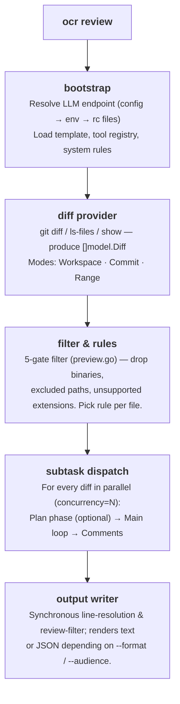
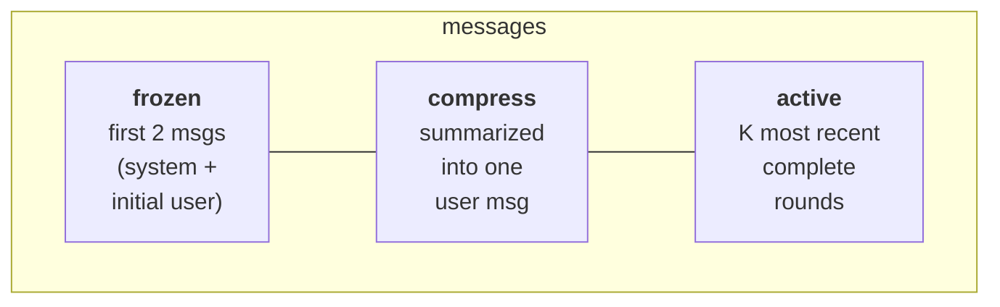

从你按下回车到 JSON 落在终端，`ocr review` 内部实际如何运作的导览。旨在帮你
建立足够的心智模型，以调试行为、调优参数，并有把握地阅读源码。

## 高层流水线



编排逻辑位于
[`internal/agent/`](https://github.com/alibaba/open-code-review/blob/main/internal/agent/)
包，分布在四个文件：`agent.go`（主循环与分发）、`compression.go`（记忆压缩）、
`preview.go`（文件过滤）和 `util.go`（辅助）。两个入口点值得关注：`Agent.Run`
（流水线顶部）和 `Agent.dispatchSubtasks`（per-file 扇出）。

## diff provider

`internal/diff/git.go` 定义了一个 `Provider` 结构，其未导出字段 `mode`（类型为
`Mode`，一个 `int` 枚举）选择与 CLI 参数对应的三种模式之一：

| 模式 | 触发方式 | 返回内容 |
|---|---|---|
| `Workspace` | 无参数 | staged + unstaged + untracked 变更 |
| `Commit` | `--commit <sha>` / `-c <sha>` | `<sha>` 引入的变更（经 `git show <sha>`，等价于 `<sha>^..<sha>` diff） |
| `Range` | `--from <a> --to <b>` | `merge-base(a, b)..b` |

每个 diff 携带：old/new path、old/new hunk、插入/删除计数、二进制标志、重命名
检测。`DiffContextLines` 固定为 **3**——与 Git 默认一致。

untracked 文件从磁盘读取并作为整文件新增处理，以便 commit 前评审。

## 五重门文件过滤

diff 加载后，每个文件经过
[`whyExcluded`](https://github.com/alibaba/open-code-review/blob/main/internal/agent/preview.go)。
该函数返回以下之一：

```
binary          — file is binary
user_exclude    — matched a pattern in your `exclude` list
unsupported_ext — extension is not in supported_file_types.json
default_path    — matched a built-in test-file exclude pattern
```

……或文件被保留时返回空。`deleted` **不**由 `whyExcluded` 返回；它在 `Preview()`
中随后计算——当一个被保留文件的 diff 报告 `IsDeleted` 时。各门按以下顺序执行：

1. `binary`——二进制文件先被丢弃。
2. `user_exclude`——你项目的 `exclude` 总是优先。
3. `user_include`——若配置了 include 模式**且**文件匹配其一，立即保留
   （返回空），绕过下面的 `unsupported_ext` 和 `default_path` 门。
4. `unsupported_ext` 按扩展名白名单过滤。
5. `default_path` 是最后一道门：匹配内置**测试文件**排除模式
   （`**/*_test.go`、`**/*.test.{js,jsx,ts,tsx}`、`**/__tests__/**`、
   `**/*_test.py`、`**/*_spec.rb`、`**/*.test.ets`……）。每个模式都以
   `**/` 作为根前缀。

噪声目录过滤（`vendor/`、`node_modules/`、`target/`……）发生在更早的阶段，
位于 diff-provider 层，通过 `internal/diff/git.go` 中的 `providerDirIgnoreDirs`
列表——这些目录的 diff 被解析后由 `filterDiffs` 剔除，永远不会到达 per-file
过滤器。

运行 `ocr review --preview` 可不花 token 查看完整过滤结果。完整算法见
[评审规则](../review-rules/#how-files-are-filtered)。

## per-file 子任务：plan + main

对每个通过过滤的文件，OCR 启动一个子 agent。每个子 agent 在自己的 goroutine
中运行，受 `--concurrency`（默认 **8**）约束，并有独立的 LLM 消息缓冲区。

一个子任务最多有**两个阶段**：

### 阶段 1——Plan（可选）

```go
threshold := template.PlanModeLineThreshold     // 50
changeLines := d.Insertions + d.Deletions
if changeLines < threshold { skip plan }
```

对小 diff，plan 只会增加延迟、没有价值，因此被静默跳过，main 循环直接运行。对较大
diff，OCR 做一次**单次** `PLAN_TASK` LLM 调用——不发送 `Tools` 字段，因此模型
在 plan 期间不能调用工具。只读工具子集（`code_search`、`file_read_diff`、
`file_find`——`tools.json` 中 `plan_task` 标志为 `true` 的那三个）作为纯文本
通过 `{{plan_tools}}` 占位符（由 `formatToolDefs` 渲染）嵌入，
让模型知道后续可用什么。模型返回一份清单，作为 main prompt 中的
`{{plan_guidance}}`。

### 阶段 2——main 循环

main 循环组装 `MAIN_TASK` prompt，与模型展开工具调用对话。完整工具集在
plan 阶段工具基础上加 **`task_done`**、**`code_comment`** 和
**`file_read`**——完整清单见[工具](../tools/)。

```
loop up to MAX_TOOL_REQUEST_TIMES (default 30):
    response = llm.complete(messages, tools)
    if response.toolCalls is empty:
        nudge model with "You did not successfully call any tools.
                          Please try again or use task_done if finished."
        continue
    for each call: execute → collect result
    if any call was task_done: break
    addNextMessage(...)              # may trigger compression
```

循环有五个退出条件：

1. 调用了 `task_done`。
2. `MAX_TOOL_REQUEST_TIMES` 耗尽。
3. 连续 3 轮未产生有效工具结果（`maxConsecutiveEmptyRounds = 3`）。
4. context 被取消。
5. `addNextMessage` 返回 false——压缩无法把消息缓冲区压回警告阈值以下。

无论哪种情况，已收集的 `code_comment` 调用都成为评审评论。

## 记忆压缩

长的工具调用循环最终会溢出上下文窗口。OCR 用**三分区**策略管理，触发于
`MAX_TOKENS = 58888` 定义的 token 预算：

| 阈值 | 常量 | 动作 |
|---|---|---|
| MAX_TOKENS 的 60 % | `tokenSoftThreshold` | 启动**异步**后台压缩；当前循环不中断继续。 |
| MAX_TOKENS 的 80 % | `tokenWarningThreshold` | 在发送下一个请求前**同步**运行压缩。 |

### 三个区



一“轮”是一条 assistant 消息加上其后跟随的工具结果消息。`partitionMessages`
从末尾向前遍历轮次，保留能装入 `(0.80 × MAX_TOKENS) - reservedTokens` 的尽可能
多的轮。更早的内容成为 **compress 区**。

compress 区被渲染为 XML，用 `MEMORY_COMPRESSION_TASK` prompt 交给模型；返回的
摘要被追加到原始 user 消息内，包在 `<previous_review_summary>` 标签里。

压缩后：`messages = frozen[2] + compressed_user_msg + active`。

```go
// compression.go
func (a *Agent) runCompression(ctx context.Context, msgs []llm.Message, filePath string) ([]llm.Message, error) {
    part := partitionMessages(msgs, a.args.Template.MaxTokens, 0)
    contextXML := buildMessageXML(msgs[part.frozenEnd:part.compressEnd])
    // … call MEMORY_COMPRESSION_TASK …
    rebuilt[1] = llm.NewTextMessage(role, currentText+
        "\n\n<previous_review_summary>\n"+rawSummary+"\n</previous_review_summary>")
    for i := part.compressEnd; i < len(msgs); i++ {
        rebuilt = append(rebuilt, msgs[i])
    }
    return rebuilt, nil
}
```

### 异步 vs 同步

异步路径让 main 循环在后台压缩运行时继续产出工具调用；当下一次 token 检查发生
时，已就绪的摘要会通过 `tryApplyPendingCompression` 应用。若比例在异步任务完成前越过
警告阈值，循环会停顿并同步运行 `runCompression`——保证下一个请求总是装得下。

## 评论处理流水线

每个 `code_comment` 工具调用产出一条或多条原始评论。它们经过一个
**CommentWorkerPool**（固定大小 goroutine 池），使主工具调用循环永不阻塞在
后处理上：

1. **行解析**（worker 内）——`existing_code` 用滑动窗口算法与 diff 匹配以计算
   精确的 `start_line` / `end_line`。匹配失败则两者默认为 `0`——`0` 行范围是
   “未锚定”评论的隐式信号，用户需手动定位（没有存储标志；下游消费者检查
   `start_line == 0`）。
2. **重新定位任务** *（可选回退）*——当行解析在较复杂的 diff 上失败时，OCR 运行
   `RE_LOCATION_TASK` prompt，请模型重新锚定片段。对改写过的 `existing_code`
   字符串有用。
3. **评审过滤**——main 循环结束后（worker 池排空），`REVIEW_FILTER_TASK` LLM
   调用对照 diff 检查收集到的评论，移除可证明为错的评论。此处错误被记录并忽略。
4. **第二轮行解析**——`Agent.Run` 返回后，顶层命令对完整评论集重跑
   `diff.ResolveLineNumbers`（见 `cmd/opencodereview/review_cmd.go`），以捕获
   `existing_code` 跨多文件或被重新定位步骤更新的评论。
5. **渲染**——按 `--format` 渲染为 text 或 JSON。

## token 预算守卫

在调用 LLM 之前，OCR 先做一个 fail-fast 检查：

```go
tokenLimit := MaxTokens * 4 / 5     // 80 %
if countMessagesTokens(messages) > tokenLimit {
    record warning "token_threshold_exceeded"
    return nil      // skip this file
}
```

这会在巨大 diff（自动生成的 lock 文件、触及数千行的重构）耗费请求之前把它们拦截下来。
被跳过的文件作为非致命警告在 stdout 报告，并加入 JSON `warnings` 数组。

第二个检查在 `filterLargeDiffs` 中运行：若 diff 单独超过 `MAX_TOKENS` 的 80 %，
它在 per-file 分发器启动前就被过滤掉。

## 模板与占位符

`internal/config/template/task_template.json` 含**五个 prompt**：

| Key | 用途 |
|---|---|
| `PLAN_TASK` | plan 阶段——产出清单。 |
| `MAIN_TASK` | main 评审循环——发出 `code_comment` 调用。 |
| `MEMORY_COMPRESSION_TASK` | 摘要 compress 区。 |
| `REVIEW_FILTER_TASK` | 循环后移除可证明为错评论的流程。 |
| `RE_LOCATION_TASK` | 为 `existing_code` 无法匹配的评论重新锚定。 |

每个 prompt 是一个 `{role, prompt_file}` 引用列表，指向模板目录中的 `.md` 文件
（如 `{"role": "system", "prompt_file": "main_task_system.md"}`）。加载时
`resolveConversation` 把这些文件读入内存中的 `{role, content}` 消息，随后模板
占位符按文件解析：

| 占位符 | 替换为 |
|---|---|
| `{{system_rule}}` | 从四层链解析出的规则正文。 |
| `{{change_files}}` | PR 中其他每个变更文件的状态 + 路径。 |
| `{{diff}}` | 本文件的 diff（原始 `git diff` 输出）。 |
| `{{current_file_path}}` | 本文件的新路径。 |
| `{{plan_guidance}}` | plan 阶段的输出，plan 被跳过时移除。 |
| `{{plan_tools}}` | plan 阶段工具定义的纯文本（由 `formatToolDefs` 渲染），用于 `PLAN_TASK` system prompt。 |
| `{{requirement_background}}` | `--background` 参数内容。 |
| `{{current_system_date_time}}` | 运行的本地时间戳，格式 `YYYY-MM-DD HH:MM`（无秒或时区）。 |
| `{{context}}` | （仅压缩）要摘要的 XML 渲染消息。 |
| `{{path}}` | 文件路径，用于 `REVIEW_FILTER_TASK`。 |
| `{{comments}}` | 累积的评论（JSON），用于 `REVIEW_FILTER_TASK`。 |

占位符替换位于
[`agent.go`](https://github.com/alibaba/open-code-review/blob/main/internal/agent/agent.go)。
模板本身不是 CLI 覆盖——要修改 prompt，你需要编辑
[`task_template.json`](https://github.com/alibaba/open-code-review/blob/main/internal/config/template/task_template.json)
并重新构建。`--tools` 参数是*工具注册表*覆盖（它替换 `internal/config/toolsconfig`
消费的 JSON），不是模板覆盖——见[工具](../tools/#customizing-tools)。

> **占位符语法注意。** 以上所有占位符都使用双花括号
> `{{…}}` 语法，*除了* `RE_LOCATION_TASK`，它替换单花括号
> 的 `{diff}`、`{existing_code}` 和 `{suggestion_content}`
> （见 `internal/diff/relocation.go`）。

## 持久化

每次评审以 JSONL 写入磁盘：

```
~/.opencodereview/sessions/<encoded-repo-path>/<session-id>.jsonl
```

仓库路径**不**做 base64 编码；`encodeRepoPath`（在
`internal/session/persist.go`）把 `/` 和 `\` 替换为 `-`、`:` 替换为 `_`，使路径
对文件系统安全。

每行是一个事件：发送的 prompt、LLM 响应、工具调用、工具结果、发出的评论等。
Web UI（`ocr viewer`）直接读这些文件——没有数据库，只有 append-only 日志。UI
导览与事件 schema 见[会话查看器](../viewer/)。

## 遥测

启用遥测后，agent 发出三个流水线级 span（`review.run` 包裹整个作业、
`diff.parse` 包裹 diff 加载、每个被评审文件一个 `subtask.execute.<file>`），加上
每个决策点一个短生命周期的 `event.<name>` span（`plan.skipped`、
`token.threshold.exceeded`、`subtask.error`……）。LLM 往返和工具调用仅作为
metrics 记录——不作为 span。prompt 与响应内容**绝不**附加到遥测；
`OCR_CONTENT_LOGGING` 标志已接入但目前是死代码。完整 schema 见[遥测](../telemetry/)。

## 哪些*不*自动化

一些决策有意保持手动：

- **端点发现没有回退。** 若你的 config + env + rc 文件给不出完整的
  `(URL, token, model)` 三元组，OCR 以非零码退出，而非猜测。
- **子 agent 失败被隔离，不重试。** 一个失败文件产生一条警告；其余继续。重试
  属于包裹它的 CI 流水线，而非 agent。
- **无跨文件推理。** 每个文件在它自己的 LLM 对话中评审。跨文件问题通过
  `file_read_diff` / `code_search` 工具调用，而非共享上下文。那些*其他*文件中
  的发现也禁止作为评论目标——`main_task` prompt 指示模型仅将上下文工具用于
  理解，并忽略在当前 diff 之外文件中出现的问题。

这些选择让运行**按文件确定性**，并让成本可预测。

## 源码地图

若你想对照阅读：

| 关注点 | 文件 |
|---|---|
| 顶层命令分发 | `cmd/opencodereview/main.go` |
| `review` 参数解析 | `cmd/opencodereview/flags.go` |
| agent 编排与压缩 | `internal/agent/`（agent.go、compression.go、util.go） |
| 文件过滤 / 预览 | `internal/agent/preview.go` |
| diff 加载（Git 模式） | `internal/diff/git.go` |
| 规则解析链 | `internal/config/rules/system_rules.go` |
| 工具注册表与实现 | `internal/tool/` |
| LLM 端点解析器 | `internal/llm/resolver.go` |
| 会话 JSONL 写入器 | `internal/session/persist.go` |
| Web 查看器 | `internal/viewer/server.go` |

构建与测试说明见[贡献](../contributing/)。

## 另见

- [工具](../tools/)——agent 循环调用的六种工具。
- [评审规则](../review-rules/)——按文件的规则文本如何解析。
- [会话查看器](../viewer/)——检查此流水线写出的转录。
